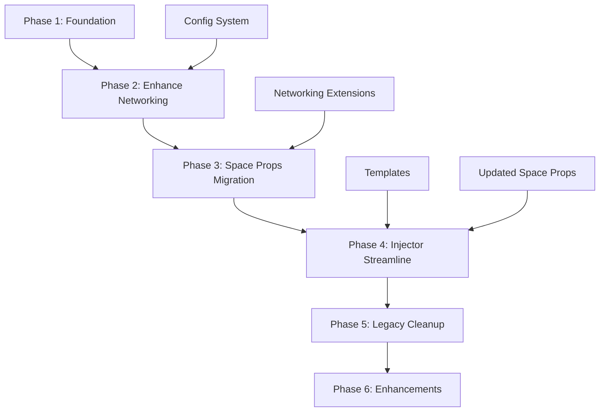

# Unified Firebase Migration & Inspector Streamline Plan

## Executive Summary
This plan unifies two major refactoring efforts:
1. **Space Properties Panel**: Direct Firebase integration replacing spaceState
2. **Inspector Injector**: Template-based, modular architecture with streamlined UX

Both efforts are interdependent and should be executed in coordinated phases to minimize disruption while maximizing benefits.

## Dependencies Map


## Phase 1: Foundation Layer (Days 1-3)

### 1.1 Template System Setup
**Priority**: HIGH
**Dependencies**: None
**Files to Create**:
```
frontend/
├── templates/
│   ├── navigation.html
│   ├── world-inspector.html
│   ├── space-props.html
│   ├── inventory.html
│   └── feedback.html
├── js/
│   ├── template-loader.js
│   └── config.js
```

**Implementation**:
```javascript
// frontend/js/template-loader.js
export class TemplateLoader {
    constructor(baseUrl) {
        this.baseUrl = baseUrl;
        this.cache = new Map();
    }

    async load(templateName) {
        if (this.cache.has(templateName)) {
            return this.cache.get(templateName);
        }
        const response = await fetch(`${this.baseUrl}/templates/${templateName}.html`);
        const template = await response.text();
        this.cache.set(templateName, template);
        return template;
    }
}
```

### 1.2 Configuration System
**Priority**: HIGH
**Dependencies**: None
**Implementation**:
```javascript
// frontend/js/config.js
export class InspectorConfig {
    constructor(options = {}) {
        this.config = {
            firebase: {
                projectId: options.firebaseProjectId || 'inspector-6bad1',
                databaseURL: options.firebaseDatabaseURL || 'https://inspector-6bad1-default-rtdb.firebaseio.com',
            },
            features: {
                useTemplates: options.useTemplates !== false,
                useFirebaseVars: options.useFirebaseVars !== false,
                legacySpaceState: options.legacySpaceState || false
            }
        };
    }
}
```

### 1.3 Extract Current HTML to Templates
**Priority**: MEDIUM
**Dependencies**: 1.1
**Actions**:
1. Extract HTML from inspector-injector.js lines 197-431
2. Split into logical template files
3. Preserve all data attributes and IDs
4. Remove inline event handlers

**Deliverables**:
- [ ] Template files created
- [ ] TemplateLoader class tested
- [ ] Configuration system implemented
- [ ] HTML extraction script written

## Phase 2: Enhance Networking Module (Day 4)

### 2.1 Extend Existing Networking Class
**Priority**: HIGH
**Dependencies**: 1.2
**Files to Modify**: `frontend/js/networking.js`

**Purpose**: Enhance the existing Networking class with additional listener management and helper methods needed for the space-props migration.

```javascript
// Add to existing networking.js
export class Networking {
    constructor() {
        // ... existing constructor code ...
        this.varsListeners = new Map();
    }

    // New listener management methods for space-props
    onVarsChange(callback) {
        const varsRef = this.db.ref(`space/${this.spaceId}/vars`);
        varsRef.on('value', callback);
        this.varsListeners.set(callback, varsRef);
        return callback; // Return for easy removal
    }

    offVarsChange(callback) {
        if (this.varsListeners.has(callback)) {
            const ref = this.varsListeners.get(callback);
            ref.off('value', callback);
            this.varsListeners.delete(callback);
        }
    }

    // Granular listeners for performance optimization
    onVarAdded(callback) {
        const varsRef = this.db.ref(`space/${this.spaceId}/vars`);
        varsRef.on('child_added', callback);
        return { ref: varsRef, callback, event: 'child_added' };
    }

    onVarChanged(callback) {
        const varsRef = this.db.ref(`space/${this.spaceId}/vars`);
        varsRef.on('child_changed', callback);
        return { ref: varsRef, callback, event: 'child_changed' };
    }

    onVarRemoved(callback) {
        const varsRef = this.db.ref(`space/${this.spaceId}/vars`);
        varsRef.on('child_removed', callback);
        return { ref: varsRef, callback, event: 'child_removed' };
    }

    // Remove a specific listener
    removeListener(listenerInfo) {
        if (listenerInfo && listenerInfo.ref) {
            listenerInfo.ref.off(listenerInfo.event, listenerInfo.callback);
        }
    }

    // Helper to categorize vars (public vs protected)
    categorizeVars(vars = this.state.vars) {
        const result = { public: {}, protected: {} };
        Object.entries(vars || {}).forEach(([key, value]) => {
            if (key.startsWith('_')) {
                result.protected[key.substring(1)] = value;
            } else {
                result.public[key] = value;
            }
        });
        return result;
    }

    // Get all vars (snapshot)
    async getAllVars() {
        const snapshot = await this.db.ref(`space/${this.spaceId}/vars`).once('value');
        return snapshot.val() || {};
    }

    // Cleanup all listeners
    cleanupListeners() {
        this.varsListeners.forEach((ref, callback) => {
            ref.off('value', callback);
        });
        this.varsListeners.clear();
    }
}
```

### 2.2 Legacy Support (Built-in)
**Priority**: HIGH
**Dependencies**: 2.1
**Purpose**: The existing `window.net` global already provides backward compatibility

The current `Networking` class already:
- Maintains the `window.net` global reference (line 464)
- Provides `getDatabase()` and `getStorage()` methods
- Manages space state through `this.state`
- Offers `getVar()`, `setVar()`, `delVar()` methods

No additional compatibility layer needed since the existing structure provides all necessary backward compatibility.

**Deliverables**:
- [ ] Listener management methods added to Networking class
- [ ] Helper methods for var categorization implemented
- [ ] Existing net global preserved for backward compatibility
- [ ] All new methods tested with space-props integration

## Phase 3: Space Properties Panel Migration (Days 5-6)

### 3.1 Update Space Props Module
**Priority**: HIGH
**Dependencies**: 2.1
**Files to Modify**:
- `frontend/js/pages/world-inspector/space-props-panel.js`

**Implementation Steps**:
1. Add Firebase listeners using the global `net` instance
2. Replace all `SM.scene.spaceState` references
3. Use `net.categorizeVars()` for property categorization
4. Update CRUD operations to use existing `net` methods

```javascript
// Refactored space-props-panel.js excerpt
export class SpacePropsPanel {
    constructor() {
        // ... existing code ...
        this.varsCache = {};
        this.listeners = []; // Track listeners for cleanup
        this.setupFirebaseListeners();
    }

    setupFirebaseListeners() {
        // Use the global net instance directly

        // Main listener for all vars
        net.onVarsChange((snapshot) => {
            this.varsCache = snapshot.val() || {};
            this.renderFromCache();
        });

        // Granular listeners for performance
        this.listeners.push(
            net.onVarAdded((snapshot) => {
                this.handlePropertyAdded(snapshot.key, snapshot.val());
            })
        );

        this.listeners.push(
            net.onVarChanged((snapshot) => {
                this.handlePropertyChanged(snapshot.key, snapshot.val());
            })
        );

        this.listeners.push(
            net.onVarRemoved((snapshot) => {
                this.handlePropertyRemoved(snapshot.key);
            })
        );
    }

    async addProperty(key, value, isProtected = false) {
        const fullKey = isProtected ? `_${key}` : key;
        await net.SetVar(fullKey, value); // Use existing async method
    }

    async updateProperty(key, value) {
        await net.SetVar(key, value); // Use existing async method
    }

    async deleteProperty(key) {
        await net.DelVar(key); // Use existing async method
    }

    categorizeProperties() {
        // Use the new helper method from net
        return net.categorizeVars(this.varsCache);
    }

    renderFromCache() {
        const { public, protected } = this.categorizeProperties();
        this.renderPropsList('public', public);
        this.renderPropsList('protected', protected);
    }

    cleanup() {
        // Remove all listeners on cleanup
        this.listeners.forEach(listener => {
            net.removeListener(listener);
        });
    }
}
```

### 3.2 Update SpacePropertyChange Class
**Priority**: HIGH
**Dependencies**: 3.1
**File**: `frontend/js/change-types.js`

```javascript
export class SpacePropertyChange extends Change {
    constructor(key, value, isProtected, options) {
        super();
        this.key = isProtected ? `_${key}` : key;
        this.value = value;
        this.oldValue = options?.oldValue;
    }

    async apply() {
        // Store old value if not already set
        if (this.oldValue === undefined) {
            this.oldValue = net.getVar(this.key);
        }
        // Use existing net methods
        await net.SetVar(this.key, this.value);
        await super.apply();
    }

    async undo() {
        if (this.oldValue !== undefined) {
            await net.SetVar(this.key, this.oldValue);
        } else {
            await net.DelVar(this.key);
        }
        await super.undo();
    }
}
```

### 3.3 Remove Legacy Event Listeners
**Priority**: MEDIUM
**Dependencies**: 3.1, 3.2
**Actions**:
1. Remove `spaceStateChanged` event listener (line 564-565)
2. Remove any OneShot references for space props
3. Update all event dispatching to rely on Firebase listeners

**Deliverables**:
- [ ] Space props using Firebase directly
- [ ] All CRUD operations migrated
- [ ] Legacy events removed
- [ ] Real-time sync working

## Phase 4: Inspector Injector Streamline (Days 7-9)

### 4.1 Refactor InspectorInjector
**Priority**: HIGH
**Dependencies**: 1.1, 1.2, 3.1
**File**: `frontend/inspector-injector.js`

```javascript
export class InspectorInjector {
    constructor(options = {}) {
        this.config = new InspectorConfig(options);
        this.container = options.container || document.body;
        this.templateLoader = new TemplateLoader(this.config.api.baseUrl);
        this.modules = new Map();
    }

    async inject() {
        try {
            // 1. Ensure Firebase is initialized via net
            // The net instance handles Firebase initialization
            if (!net.db) {
                await new Promise((resolve) => {
                    net.initFirebase((spaceState) => {
                        console.log('Firebase initialized with space state:', spaceState);
                        resolve();
                    });
                });
            }

            // 2. Load templates
            const templates = await this.loadTemplates();

            // 3. Create DOM structure
            await this.createStructure(templates);

            // 4. Initialize modules
            await this.initializeModules();

            // 5. Setup event delegation
            this.setupEventDelegation();

            // 6. Load initial data
            await this.loadInitialData();

        } catch (error) {
            console.error('Failed to inject inspector:', error);
            this.showErrorState(error);
        }
    }

    async loadTemplates() {
        if (this.config.features.useTemplates) {
            return await this.templateLoader.loadAll();
        } else {
            // Fallback to inline HTML for backward compatibility
            return this.getInlineTemplates();
        }
    }

    async createStructure(templates) {
        const html = `
            <div id="inspector-root" class="inspector-firebase">
                ${templates.navigation}
                <div class="inspector-content">
                    ${this.createPages(templates)}
                </div>
            </div>
        `;
        this.container.innerHTML = html;
    }

    async initializeModules() {
        // Initialize space props with new Firebase integration
        const spacePropsEl = document.querySelector('.space-props-panel');
        if (spacePropsEl) {
            const SpacePropsPanel = (await import('./js/pages/world-inspector/space-props-panel.js')).SpacePropsPanel;
            const spaceProps = new SpacePropsPanel();
            this.modules.set('spaceProps', spaceProps);
        }

        // Initialize other modules...
    }

    setupEventDelegation() {
        // Replace all onclick handlers with delegation
        this.container.addEventListener('click', (e) => {
            const target = e.target;

            // Handle space props actions
            if (target.matches('[data-action="add-var"]')) {
                this.handleAddVar(target);
            }

            // Handle navigation
            if (target.matches('[data-page]')) {
                this.navigateToPage(target.dataset.page);
            }

            // ... other delegated handlers
        });
    }
}
```

### 4.2 Remove Inline Event Handlers
**Priority**: HIGH
**Dependencies**: 4.1
**Actions**:
1. Remove all `onclick` attributes from HTML
2. Replace with data attributes
3. Implement event delegation in setupEventDelegation()

### 4.3 Simplify Configuration
**Priority**: MEDIUM
**Dependencies**: 4.1
**Actions**:
1. Remove file server options (stable, ngrok, local, unity)
2. Use environment detection for automatic configuration
3. Centralize all config in InspectorConfig class

**Deliverables**:
- [ ] Templates loading correctly
- [ ] Event delegation working
- [ ] Modules initialized properly
- [ ] Configuration simplified

## Phase 5: Legacy Cleanup (Days 10-11)

### 5.1 Remove Deprecated Code
**Priority**: MEDIUM
**Dependencies**: All previous phases
**Files to Clean**:
- `space-props-panel.js` - Remove spaceState references
- `inspector-injector.js` - Remove inline HTML

### 5.2 Update Documentation
**Priority**: HIGH
**Dependencies**: 5.1
**Actions**:
1. Update CLAUDE.md with new architecture
2. Create migration guide for developers
3. Document new Firebase structure
4. Update API documentation

### 5.3 Deprecation Warnings
**Priority**: MEDIUM
**Dependencies**: 5.1
**Implementation**:
```javascript
// Add deprecation warnings for legacy patterns
const deprecated = (oldMethod, newMethod) => {
    console.warn(`DEPRECATED: ${oldMethod} is deprecated. Use ${newMethod} instead.`);
    console.trace();
};

// Example usage
Object.defineProperty(window, 'spaceState', {
    get() {
        deprecated('spaceState', 'Firebase vars');
        return {};
    }
});
```

**Deliverables**:
- [ ] Legacy code removed
- [ ] Documentation updated
- [ ] Deprecation warnings added
- [ ] Code size reduced by 30%+

## Phase 6: Enhancements & Optimization (Days 12-13)

### 6.1 Performance Optimizations
**Priority**: LOW
**Dependencies**: Phase 5
**Actions**:
1. Implement virtual scrolling for large property lists
2. Add debouncing for rapid updates
3. Implement property value caching
4. Add lazy loading for templates

### 6.2 Offline Support
**Priority**: MEDIUM
**Dependencies**: Phase 5
**Implementation**:
```javascript
class OfflineManager {
    constructor(firebase) {
        this.firebase = firebase;
        this.pendingChanges = [];
        this.setupConnectivityMonitoring();
    }

    setupConnectivityMonitoring() {
        const connectedRef = this.firebase.db.ref('.info/connected');
        connectedRef.on('value', (snapshot) => {
            if (snapshot.val() === true) {
                this.syncPendingChanges();
            }
        });
    }

    async syncPendingChanges() {
        while (this.pendingChanges.length > 0) {
            const change = this.pendingChanges.shift();
            await this.applyChange(change);
        }
    }
}
```

### 6.3 Enhanced Error Handling
**Priority**: MEDIUM
**Dependencies**: Phase 5
**Actions**:
1. Add error boundaries
2. Implement retry logic for failed Firebase operations
3. Add user-friendly error messages
4. Create fallback UI states

**Deliverables**:
- [ ] Performance metrics improved
- [ ] Offline support working
- [ ] Error handling robust
- [ ] User experience enhanced

## Testing Strategy

### Unit Tests (Continuous)
```javascript
// Example test structure
describe('SpacePropsPanel', () => {
    it('should sync properties across clients', async () => {
        // Test implementation
    });

    it('should handle offline/online transitions', async () => {
        // Test implementation
    });

    it('should categorize properties correctly', () => {
        // Test implementation
    });
});
```

### Integration Tests (Per Phase)
1. **Phase 1**: Template loading, configuration
2. **Phase 2**: Firebase operations, compatibility
3. **Phase 3**: Space props CRUD, real-time sync
4. **Phase 4**: Injector initialization, module loading
5. **Phase 5**: Legacy code removal verification
6. **Phase 6**: Performance benchmarks, offline scenarios

### End-to-End Tests (Final)
- Multi-client synchronization
- Large dataset handling (100+ properties)
- Network failure recovery
- Browser compatibility

## Rollback Strategy

### Feature Flags
```javascript
const FEATURES = {
    USE_FIREBASE_VARS: true,
    USE_TEMPLATES: true,
    USE_LEGACY_SPACE_STATE: false,
    ENABLE_OFFLINE_SUPPORT: false
};
```

### Rollback Steps
1. **Immediate**: Toggle feature flags
2. **Quick**: Restore backup files (*.backup.js)
3. **Full**: Git revert to previous stable commit

### Backup Points
- Before Phase 1: Full codebase backup
- After Phase 2: Firebase integration checkpoint
- After Phase 3: Space props migration checkpoint
- After Phase 4: Injector refactor checkpoint

## Timeline Summary

| Phase | Duration | Dependencies | Risk Level |
|-------|----------|--------------|------------|
| 1. Foundation | 3 days | None | Low |
| 2. Enhance Networking | 1 day | Phase 1 | Low |
| 3. Space Props | 2 days | Phase 2 | Medium |
| 4. Injector | 3 days | Phase 1,3 | High |
| 5. Cleanup | 2 days | Phase 1-4 | Low |
| 6. Enhancements | 2 days | Phase 5 | Low |
| **Total** | **13 days** | - | - |

## Success Metrics

### Performance
- [ ] Initial load time < 500ms
- [ ] Firebase sync latency < 100ms
- [ ] Template caching reduces requests by 80%
- [ ] Code size reduced by 30%

### Quality
- [ ] Zero inline event handlers
- [ ] 100% Firebase-based state management
- [ ] All properties sync in real-time
- [ ] Backward compatibility maintained

### User Experience
- [ ] Seamless property editing
- [ ] No UI freezes during sync
- [ ] Clear offline indicators
- [ ] Improved error messages

## Risk Mitigation

### High Risk Areas
1. **Firebase Migration**: Test thoroughly with multiple clients
2. **Template System**: Ensure fallback for template loading failures
3. **Legacy Code Removal**: Maintain compatibility layer longer if needed

### Mitigation Strategies
1. **Incremental Rollout**: Deploy to staging first
2. **Feature Flags**: Control feature exposure
3. **Monitoring**: Add analytics for error tracking
4. **Communication**: Notify users of changes in advance

## Next Steps

### Immediate Actions (Week 1)
1. Set up feature branch
2. Create template directory structure
3. Implement TemplateLoader class
4. Begin HTML extraction

### Follow-up Actions (Week 2)
1. Implement Firebase service layer
2. Begin space props migration
3. Set up testing framework
4. Create rollback procedures

### Final Actions (Week 3)
1. Complete injector refactor
2. Remove legacy code
3. Add enhancements
4. Deploy to production

## Conclusion

This unified plan coordinates both major refactoring efforts into a cohesive migration strategy that leverages our existing infrastructure. By executing these phases in order, we'll achieve:

1. **Clean Architecture**: Separation of concerns with templates and modules while maintaining centralized networking
2. **Real-time Sync**: Direct Firebase integration through the existing Networking class for instant updates
3. **Better Maintainability**: Modular, testable code with a single source of truth for networking operations
4. **Improved Performance**: Optimized rendering and caching with reduced code redundancy
5. **Future-Ready**: Foundation for further enhancements without unnecessary abstraction layers

The simplified approach:
- **Reduces development time** from 15 to 13 days
- **Minimizes risk** by using battle-tested existing code
- **Maintains backward compatibility** through the existing `window.net` global
- **Centralizes networking logic** in one well-understood module

The phased approach ensures each change builds on previous work while maintaining system stability throughout the migration.